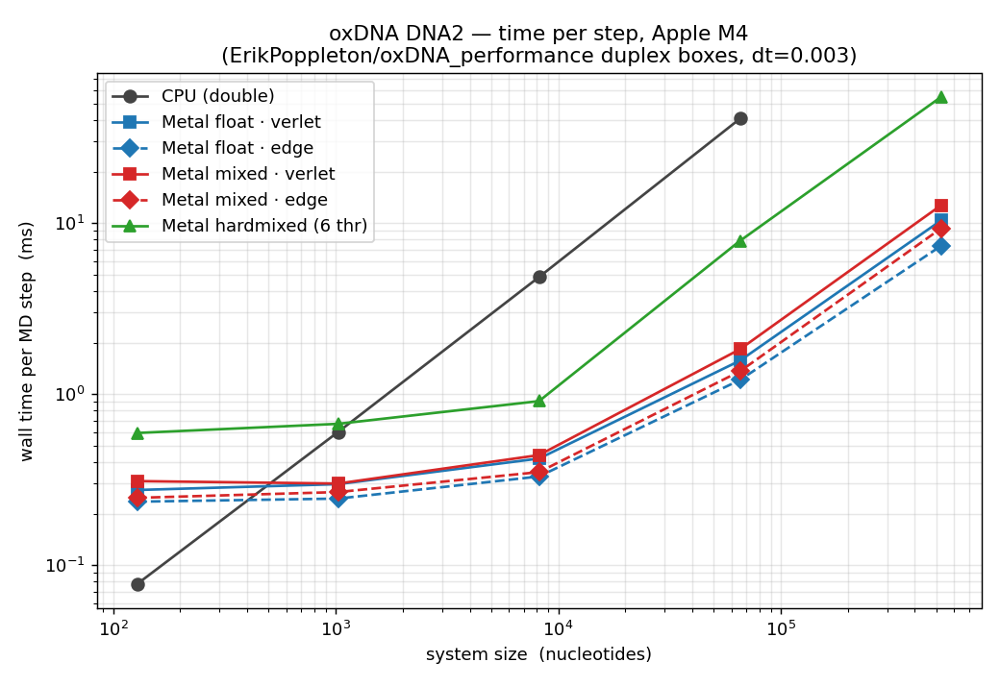
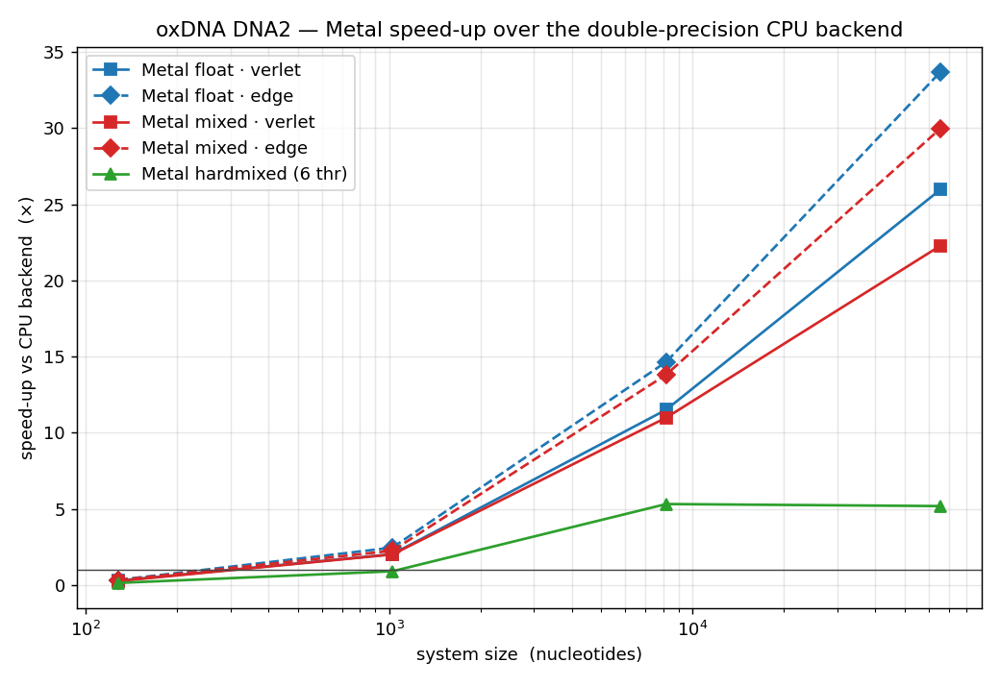
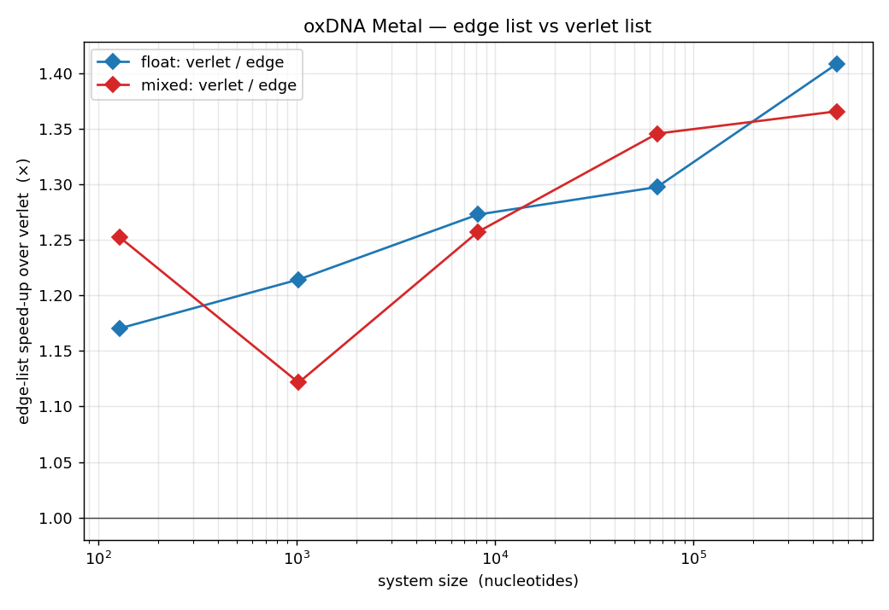
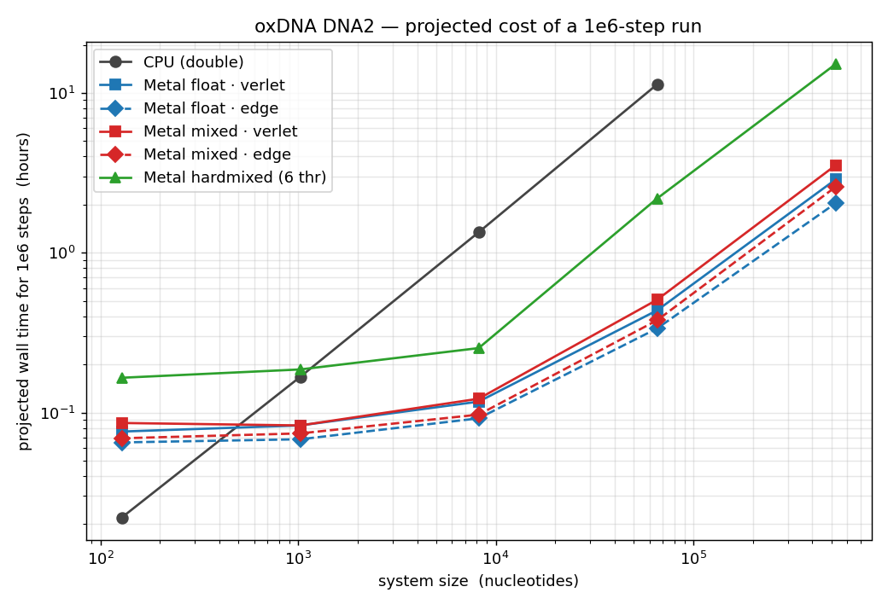

# Metal backend benchmarks

Wall-clock performance of the oxDNA Metal backend on the duplex-box systems from
[ErikPoppleton/oxDNA_performance](https://github.com/ErikPoppleton/oxDNA_performance)
(DNA2, `dt = 0.003`, Brownian thermostat, `verlet_skin = 0.5`, average-sequence
model — the same input those benchmarks use for CUDA).

- `run_metal_benchmark.sh` — runs the matrix (see the header for usage).
- `plot_benchmark.py` — turns `results*.csv` into the plots.
- `results_m4.csv`, `plots/` — a run on an **Apple M4** (10-core CPU / 10-core
  GPU, 16 GB), oxDNA built `-DCMAKE_BUILD_TYPE=Release`, CPU binary `-DDOUBLE=ON`.

`ms_per_step` is measured by running two step counts and subtracting, so the
one-off start-up cost (config loading, list build, shader load) cancels; best of
two repeats.

## Results (Apple M4)

Time per MD step, milliseconds:

| nucleotides | CPU (double) | Metal float / verlet | Metal float / **edge** | Metal mixed / verlet | Metal mixed / edge | Metal hardmixed (6 thr) |
|---:|---:|---:|---:|---:|---:|---:|
|      128 |   0.078 | 0.275 | **0.235** | 0.310 | 0.248 | 0.593 |
|    1 024 |   0.600 | 0.298 | **0.245** | 0.300 | 0.268 | 0.670 |
|    8 192 |   4.833 | 0.420 | **0.330** | 0.440 | 0.350 | 0.910 |
|   65 536 |  40.74  | 1.570 | **1.210** | 1.830 | 1.360 | 7.870 |
|  524 288 |   —     | 10.35 | **7.35**  | 12.70 | 9.30  | 54.55 |

Takeaways:

- **Crossover** at roughly 400 nucleotides — below that the GPU launch overhead
  (~0.25 ms/step floor) loses to the CPU; above it the GPU pulls away fast.
- **`Metal_list = edge` is the fastest option at every size**, and its advantage
  over the verlet list *grows* with the system: 1.17× at 128 nt → 1.30× at
  65 536 nt → 1.41× at 524 288 nt (each non-bonded pair is evaluated once
  instead of twice, and the fixed two-kernel cost amortises away).
- **float vs mixed (df64):** `mixed` costs +5–17 % over `float` for
  drift-resistant df64 positions/integration — cheap insurance for long runs.
- **hardmixed** (GPU float forces, CPU `double` velocity-Verlet, OpenMP) is
  3–7× slower than `float` because of the per-step GPU↔CPU round trip; use it
  only when the integration really must be double precision.
- **Speed-up over the CPU backend** (float / edge): ~15× at 8 192 nt, **~34× at
  65 536 nt**.

> These systems are boxes of 8-bp duplexes, not folded origami — the
> oxDNA_performance repo notes "Full DNA origamis are around 14 000 nucleotides"
> but ships none. The 8 192- and 65 536-nucleotide points bracket the
> origami-scale regime.
