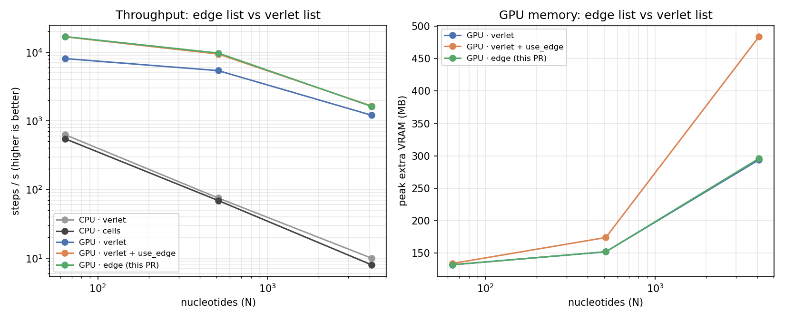

# Benchmarks

`run_benchmark.sh` compares the new direct GPU edge list (`CUDA_list = edge`,
see `docs/source/input.md`) against:

* the existing Verlet list (`CUDA_list = verlet`), with and without
  `use_edge = true` — the latter is the current fastest way to run
  edge-parallel forces on the GPU, and is what `CUDA_list = edge` is meant
  to replace;
* `list_type = verlet` vs `list_type = cells` on CPU, included only as a
  reference point (these two pre-date this change and are unrelated to it).

## Usage

```
./run_benchmark.sh [build_dir] [steps] [bench_data_dir]
```

`bench_data_dir` should point at a checkout of
[ErikPoppleton/oxDNA_performance](https://github.com/ErikPoppleton/oxDNA_performance),
which provides the DNA2 systems used for timing (`N64`, `N512`, `N4096`, ...).
Results are written to `results/summary.csv`; `python3 plot_results.py`
turns that into a graph.

## Example result

RTX 3060 Laptop GPU, DNA2, `backend_precision = mixed`, 3000 steps:



| N (nt) | verlet | verlet + use_edge | edge (this PR) | edge VRAM saved |
|---:|---:|---:|---:|---:|
| 1 024  | 8 065 steps/s, 132 MB  | 16 760 steps/s, 134 MB | 16 854 steps/s, 132 MB | 2 MB |
| 8 192  | 5 386 steps/s, 152 MB  | 9 404 steps/s, 174 MB  | 9 709 steps/s, 152 MB  | 22 MB |
| 65 536 | 1 208 steps/s, 294 MB  | 1 647 steps/s, 484 MB  | 1 626 steps/s, 296 MB  | 188 MB (-39%) |

`edge` matches `verlet + use_edge` throughput at every size (within run-to-run
noise) while its peak GPU memory tracks plain `verlet` instead: it never
allocates the `N * max_neigh` neighbour matrix that `use_edge` compresses
after the fact, so the saving grows with `N` instead of adding on top of it.

Two things worth knowing before using it:

* `CUDA_list = edge` requires `use_edge = true` (enforced with a clear error
  at startup) and, like `use_edge` in general, is not compatible with
  `backend_precision = double`.
* On CPU, `list_type = verlet` and `list_type = cells` are unaffected by this
  PR — they're shown above only for scale.
