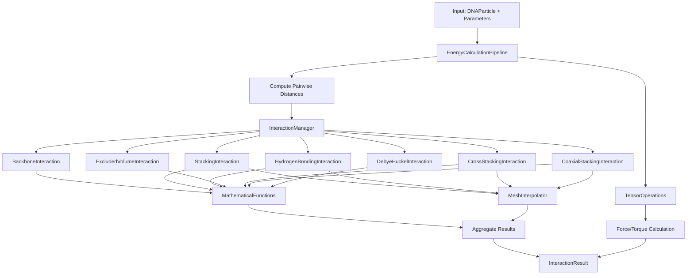

# DNA2 Energy Calculator Class Diagram

## Mermaid Class Diagram

```mermaid
classDiagram
    %% Main Interface
    class DNA2EnergyCalculator {
        -DNA2Parameters params_
        -DeviceManager device_manager_
        -EnergyCalculationPipeline pipeline_
        -BatchProcessor batch_processor_
        -MemoryPool memory_pool_
        +DNA2EnergyCalculator(params, device)
        +compute_energy(particles) Tensor
        +compute_forces(particles) Tensor
        +compute_energy_and_forces(particles) tuple
        +compute_energy_batch(batch) Tensor
        +compute_forces_batch(batch) Tensor
        +compute_energy_autograd(positions, orientations) Tensor
        +set_parameters(params)
        +to(device)
    }

    %% Data Structures
    class DNAParticle {
        +Tensor positions
        +Tensor orientations
        +Tensor orientations_t
        +Tensor backbone_centers
        +Tensor stack_centers
        +Tensor base_centers
        +Tensor types
        +Tensor btypes
        +Tensor strand_ids
        +Tensor n3_neighbors
        +Tensor n5_neighbors
        +Tensor bonded_mask
    }

    class DNA2Parameters {
        +float fene_eps
        +float fene_r0
        +float fene_delta
        +float excl_eps
        +Tensor excl_sigma
        +Tensor excl_rstar
        +Tensor excl_b
        +Tensor excl_rc
        +float hydr_eps
        +float hydr_a
        +Tensor hydr_eps_matrix
        +float stck_base_eps
        +float stck_fact_eps
        +Tensor stck_eps_matrix
        +float crst_k
        +float cxst_k
        +float salt_concentration
        +float temperature
        +bool grooving
    }

    class InteractionResult {
        +Tensor total_energy
        +Tensor forces
        +Tensor torques
        +Tensor backbone_energy
        +Tensor stacking_energy
        +Tensor hb_energy
        +Tensor excl_energy
        +Tensor crst_energy
        +Tensor cxst_energy
        +Tensor dh_energy
    }

    %% Core Components
    class EnergyCalculationPipeline {
        +compute_energy(particles, params, compute_forces, compute_torques) InteractionResult
        -compute_pairwise_distances(particles) Tensor
        -compute_interaction_center_distances(particles) Tensor
        -compute_backbone_energy(particles, distances, params) Tensor
        -compute_stacking_energy(particles, distances, params) Tensor
        -compute_hb_energy(particles, distances, params) Tensor
        -compute_forces_and_torques(particles, distances, params) pair
    }

    class InteractionManager {
        +compute_total_energy(particles, params) InteractionResult
        +compute_interaction_term(term_type, particles, params) Tensor
    }

    %% Base Interaction Class
    class BaseInteraction {
        <<abstract>>
        +compute_energy(particles, distances, params) Tensor*
        +compute_forces(particles, distances, params) pair*
        +check_applicability(particles) bool*
    }

    %% Specific Interactions
    class BackboneInteraction {
        +compute_energy(particles, distances, params) Tensor
        +compute_forces(particles, distances, params) pair
        -compute_fene_energy(r_backbone) Tensor
    }

    class StackingInteraction {
        +compute_energy(particles, distances, params) Tensor
        +compute_forces(particles, distances, params) pair
        -compute_angular_contributions(particles, distances) Tensor
    }

    class HydrogenBondingInteraction {
        +compute_energy(particles, distances, params) Tensor
        +compute_forces(particles, distances, params) pair
        -check_base_pairing(particles) Tensor
    }

    class ExcludedVolumeInteraction {
        +compute_energy(particles, distances, params) Tensor
        +compute_forces(particles, distances, params) pair
        -compute_lj_energy(r, sigma, epsilon) Tensor
    }

    class CrossStackingInteraction {
        +compute_energy(particles, distances, params) Tensor
        +compute_forces(particles, distances, params) pair
    }

    class CoaxialStackingInteraction {
        +compute_energy(particles, distances, params) Tensor
        +compute_forces(particles, distances, params) pair
        -compute_pure_harmonic(theta, type) Tensor
    }

    class DebyeHuckelInteraction {
        +compute_energy(particles, distances, params) Tensor
        +compute_forces(particles, distances, params) pair
        -compute_debye_length(params) float
    }

    %% Mathematical Functions
    class MathematicalFunctions {
        +f1(r, type, n3_types, n5_types, params) Tensor
        +f1_derivative(r, type, n3_types, n5_types, params) Tensor
        +f2(r, type, params) Tensor
        +f2_derivative(r, type, params) Tensor
        +f4(theta, type, params) Tensor
        +f4_derivative(theta, type, params) Tensor
        +f4_derivative_sin(theta, type, params) Tensor
        +f5(phi, type, params) Tensor
        +f5_derivative(phi, type, params) Tensor
        -f1_core(r, type, eps, params) Tensor
        -f2_core(r, type, params) Tensor
        -f4_core(theta, type, params) Tensor
    }

    %% Mesh Interpolation
    class MeshInterpolator {
        -unordered_map~int,MeshData~ meshes_
        +initialize_meshes(params)
        +interpolate(mesh_type, cos_values) Tensor
        +interpolate_derivative(mesh_type, cos_values) Tensor
        -cubic_hermite_interpolate(x, y, dy, query_points) Tensor
        -initialize_mesh(type, params, points, t0, tc, ts)
        -initialize_cxst_theta1_mesh(params)
    }

    class MeshData {
        +Tensor x_values
        +Tensor y_values
        +Tensor y_derivatives
        +int mesh_type
    }

    %% Utility Classes
    class DeviceManager {
        -torch::Device device_
        +instance() DeviceManager&
        +set_device(device)
        +get_device() Device
        +is_cuda() bool
    }

    class TensorOperations {
        +cross_product(a, b) Tensor
        +dot_product(a, b) Tensor
        +normalize(v) Tensor
        +matrix_transpose(m) Tensor
        +matrix_multiply(a, b) Tensor
        +compute_angles(v1, v2) Tensor
        +compute_dihedrals(v1, v2, v3, v4) Tensor
        +minimum_image_distance(r1, r2, box_size) Tensor
    }

    class MemoryPool {
        -unordered_map~string,Tensor~ tensor_cache_
        -size_t max_cache_size_
        +get_tensor(key, options, shape) Tensor
        +clear_cache()
        +set_max_cache_size(size)
    }

    class BatchProcessor {
        +process_batch(batch_particles, params) InteractionResult
        -stack_particles(batch) DNAParticle
        -unstack_results(batch_result, batch_size) vector~InteractionResult~
    }

    class AutoDiffSupport {
        +compute_energy_with_grad(particles, params) Tensor
        +compute_energy_and_forces(particles, params) tuple
        -energy_function(positions, orientations, params) Tensor
    }

    %% Validation and Error Handling
    class InputValidator {
        +validate_particles(particles)
        +validate_parameters(params)
        +validate_device_compatibility(device)
        -check_tensor_shapes(tensor, expected_shape)
        -check_tensor_device(tensor, expected_device)
    }

    class PerformanceProfiler {
        -unordered_map~string,time_point~ start_times_
        -unordered_map~string,double~ accumulated_times_
        +start_timing(operation)
        +end_timing(operation)
        +print_report()
    }

    %% Relationships
    DNA2EnergyCalculator --> DNA2Parameters
    DNA2EnergyCalculator --> EnergyCalculationPipeline
    DNA2EnergyCalculator --> BatchProcessor
    DNA2EnergyCalculator --> MemoryPool
    DNA2EnergyCalculator --> DeviceManager

    EnergyCalculationPipeline --> InteractionManager
    EnergyCalculationPipeline --> DNAParticle
    EnergyCalculationPipeline --> InteractionResult

    InteractionManager --> BaseInteraction
    BaseInteraction <|-- BackboneInteraction
    BaseInteraction <|-- StackingInteraction
    BaseInteraction <|-- HydrogenBondingInteraction
    BaseInteraction <|-- ExcludedVolumeInteraction
    BaseInteraction <|-- CrossStackingInteraction
    BaseInteraction <|-- CoaxialStackingInteraction
    BaseInteraction <|-- DebyeHuckelInteraction

    BackboneInteraction --> MathematicalFunctions
    StackingInteraction --> MathematicalFunctions
    HydrogenBondingInteraction --> MathematicalFunctions
    ExcludedVolumeInteraction --> MathematicalFunctions
    CrossStackingInteraction --> MathematicalFunctions
    CoaxialStackingInteraction --> MathematicalFunctions
    DebyeHuckelInteraction --> MathematicalFunctions

    StackingInteraction --> MeshInterpolator
    HydrogenBondingInteraction --> MeshInterpolator
    CrossStackingInteraction --> MeshInterpolator
    CoaxialStackingInteraction --> MeshInterpolator

    MeshInterpolator --> MeshData

    EnergyCalculationPipeline --> TensorOperations
    AutoDiffSupport --> TensorOperations

    DNA2EnergyCalculator --> InputValidator
    DNA2EnergyCalculator --> PerformanceProfiler
```



## Key Design Patterns

### 1. Strategy Pattern
- `BaseInteraction` serves as the strategy interface
- Each specific interaction type implements the strategy
- `InteractionManager` selects and executes appropriate strategies

### 2. Factory Pattern
- `DeviceManager` uses singleton pattern for device management
- Factory functions for creating calculator instances

### 3. Template Method Pattern
- `EnergyCalculationPipeline` defines the skeleton of energy calculation
- Individual interactions fill in specific steps

### 4. Observer Pattern
- Parameter changes can trigger updates in dependent components
- Device changes propagate through the system

### 5. Facade Pattern
- `DNA2EnergyCalculator` provides a simplified interface to the complex subsystem
- Hides implementation details from users

## Data Flow



## Memory Layout

```mermaid
graph LR
    A[CPU Memory] --> B[GPU Memory]
    B --> C[Particle Data]
    B --> D[Parameter Data]
    B --> E[Intermediate Results]
    B --> F[Mesh Data]
    
    C --> G[Positions: N×3]
    C --> H[Orientations: N×3×3]
    C --> I[Interaction Centers: N×3×3]
    
    D --> J[FENE Parameters]
    D --> K[Excluded Volume Parameters]
    D --> L[Hydrogen Bonding Parameters]
    D --> M[Stacking Parameters]
    
    E --> N[Distance Matrices]
    E --> O[Energy Terms]
    E --> P[Force Vectors]
    
    F --> Q[13 Mesh Types]
    Q --> R[X Values: Points]
    Q --> S[Y Values: Points]
    Q --> T[Derivatives: Points]